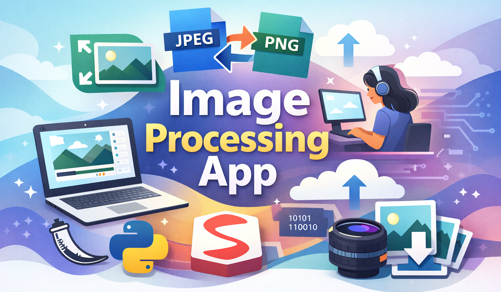

# Image Conversion App
A simple and interactive Image Conversion & Resizing Web App built with Python, Streamlit, and Pillow.  
This application allows users to upload an image, resize it (with optional aspect ratio preservation), or convert it between formats, all processed in memory without saving temporary files to disk.  


## Features
* 📏 Resize images with custom width and height
* 🔒 Optional aspect ratio preservation
* 🔄 Convert image formats (JPEG ↔ PNG)
* 💾 Download processed images instantly
* 🧠 In-memory processing using `BytesIO`
* 🌐 Interactive UI powered by Streamlit


## Project Structure
```
image_conversion/
│
├── src/
│   └── utils.py        # Image resizing and conversion logic
│   └── app.py              # Streamlit application
├── requirements.txt
└── README.md
```


## Core function
```resize_image()```
Resizes an image to a specified width and height.  
* Option to maintain original aspect ratio
* Uses:
    - `image.thumbnail()` when keeping aspect ratio
    - `image.resize()` for manual resizing

```convert_image_type()```
Converts an image to a specified format and returns it as a `BytesIO` object.
* Supports:
    - `JPEG`
    - `PNG`
* Raises `ValueError` for unsupported formats
* Saves images in memory instead of writing to disk


## How to Run
1️⃣ __Clone the repository__
```
git clone https://github.com/Sahar-Salmanz/image_conversion.git
cd image-processing-app
```

2️⃣ __Install dependencies__
```
pip install -r requirements.txt
```

3️⃣ __Run the Streamlit app__
```
streamlit run app.py
```


## Requirements
python3.10+  
streamlit=1.54.0  
Pillow=12.0.0